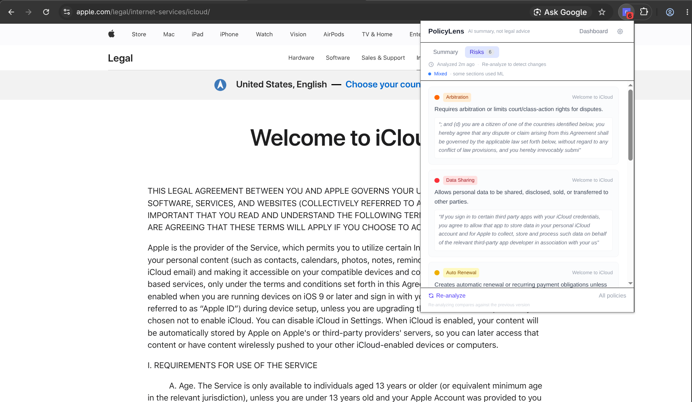

# PolicyLens



**If you care about your privacy, do not accept the terms that can quietly cost you control. PolicyLens reads policies on your device, flags clauses affecting your data and money, and shows what changed before it becomes your problem.**

PolicyLens detects policy pages in your browser, extracts and analyzes each section using a local ML model, flags risky clauses (forced arbitration, unilateral data sharing, liability waivers), and tracks changes over time so you're never blindsided by an update to a policy you already accepted.

## Why This Matters

Every time you click "I Agree" on a Terms of Service or Privacy Policy, you're signing a contract you've likely never read. Companies know this, and they exploit it. Policies are long, written in legal jargon, and change without notice. A clause that was benign last month can silently grant new data-sharing rights, remove liability protections, or force you into arbitration.

Most people have no way to track what they've already agreed to, let alone detect when something changes. PolicyLens fixes that gap: it reads policies for you, surfaces the clauses that actually affect your data and your wallet, and alerts you when a policy you've already accepted is modified, before those changes take effect.

**You deserve to know what you're agreeing to.** PolicyLens makes that possible without sending a single byte of your browsing data to any server.

## Features

- **Local-first AI:** All analysis runs on-device via Transformers.js (`Xenova/all-MiniLM-L6-v2`, quantized ONNX). Summaries are extractive with semantic ranking (MMR for diversity). No data leaves your browser, provable by checking the network tab.
- **Change detection:** Stores a snapshot of every policy you visit. When a policy is updated, PolicyLens diffs the old and new versions and highlights exactly what changed.
- **Risk flags:** Hybrid detection combining semantic embedding similarity against risk category definitions with deterministic keyword anchors. Flags data sharing, forced arbitration, auto-renewal, unilateral changes, liability waivers, and excessive data retention.
- **Dashboard:** A dedicated options page (right-click the extension icon → Options, or via the popup's Dashboard button) showing every tracked policy, its risk profile, and a history of changes. Includes a search chat for querying analyzed policies.
- **Auto-detection:** Recognizes policy pages by URL patterns (`/terms`, `/privacy`, `/legal`, etc.) and page structure (heading density + policy-specific keywords).
- **Model observability:** UI badge shows whether ML inference ran or fell back to keyword-only mode.

## Install from Source

### Prerequisites

- [Node.js](https://nodejs.org/) >= 18
- npm
- Google Chrome >= 120

### Steps

```bash
# Clone the repo
git clone https://github.com/adi-amatdev/policy-lens.git
cd policy-lens

# Install dependencies
npm install

# Build the extension
npm run build

# The output is in dist/. Load it as an unpacked extension:
# 1. Open chrome://extensions
# 2. Enable "Developer mode" (top right)
# 3. Click "Load unpacked"
# 4. Select the dist/ folder
```

For development with hot reload:

```bash
npm run dev
```

This starts a Vite dev server and outputs an unpacked extension to `dist/` that auto-rebuilds on change.

## Tech Stack

| Layer | Tool |
|---|---|
| Extension | Chrome Manifest V3, `@crxjs/vite-plugin` |
| UI | React 19, TypeScript, Tailwind CSS v4 |
| On-device ML | `@huggingface/transformers` v4 + `Xenova/all-MiniLM-L6-v2` (ONNX q8) |
| WASM runtime | ONNX Runtime Web (bundled locally in `public/ort/`, no CDN) |
| Diffing | `diff` (word-level diff for policy changes) |
| Storage | Chrome `storage` API + IndexedDB (`idb`) |
| Linting | Oxlint |
| Build | Vite 8, TypeScript |

## Architecture

```
Popup ──ANALYZE_PAGE──► Background Service Worker
                           │
                           ├─ extractPageContent() via chrome.scripting
                           ├─ createOffscreenDocument()
                           └─ SUMMARIZE_SECTIONS ──► Offscreen Document
                                                        │
                                                        ├─ Transformers.js loads Xenova/all-MiniLM-L6-v2
                                                        ├─ Embeds sentences (semantic feature extraction)
                                                        ├─ MMR sentence selection for summaries
                                                        ├─ Semantic + keyword risk classification
                                                        └─ SUMMARIZE_RESULT ──► Background
                                                                                   │
                                                                                   ├─ Save to IndexedDB
                                                                                   ├─ Update badge
                                                                                   └─ Return to Popup
```

- **Popup** never imports `model.ts`, all ML runs in the offscreen document
- **Offscreen document** hosts Transformers.js WASM inference (safe from popup destruction)
- **ONNX Runtime WASM** files are bundled locally in `public/ort/`, no CDN required
- **CSP** requires `'wasm-unsafe-eval'` for WebAssembly compilation

## Project Structure

```
src/
  background/     Service worker: orchestrates extraction, offscreen lifecycle, storage
  content/        Content script: detects policy pages, extracts sections from DOM
  offscreen/      Offscreen document: hosts Transformers.js for ML inference
  popup/          Browser action popup: triggers analysis, displays results
  dashboard/      Options page: full policy history, change log, search chat
  shared/         Core logic: detection, diffing, hashing, risk flags, model, storage
public/
  ort/            ONNX Runtime WASM binaries (bundled locally, ~23MB)
  icons/          Extension icons (16, 32, 48, 128 px)
  images/         Static images (logo)
demo/             Fixture HTML files for testing change detection
```

## How It Works

1. A content script runs on every page and checks if the URL/page content looks like a policy document.
2. If detected, it notifies the background service worker.
3. When the user clicks "Analyze This Page", the background extracts sections and sends them to the offscreen document.
4. The offscreen document loads the ML model and embeds each section.
5. **Summaries:** MMR (Maximum Marginal Relevance) selects diverse, representative sentences. Redundant filler phrases are compressed out.
6. **Risk flags:** Each sentence is scored against category embeddings (semantic similarity) plus keyword anchors (deterministic catch-all). Scores above threshold produce flags.
7. Changed sections are detected by comparing content hashes against stored snapshots, with word-level diffing.

## First Run

On first analysis, the extension downloads the quantized model weights from Hugging Face. The ONNX Runtime WASM binary (~23MB) is bundled locally in the extension, no CDN dependency. After the initial model weight download, everything is cached in the browser's Cache API and loads near-instantly.

## License

MIT
